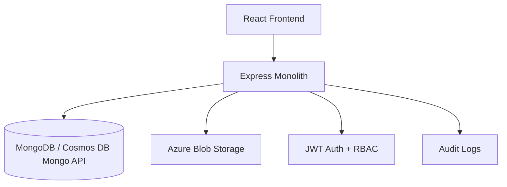

# Insurance Management System

Insurance Management System is a production-ready monolithic application with an Express API, MongoDB or Azure Cosmos DB persistence, Azure Blob document storage, and a React frontend designed for premium enterprise insurance workflows.

## Features

- JWT authentication with `ADMIN` and `USER` roles
- Insurance plan CRUD with active and inactive status control
- Automatic premium calculation by age brackets
- Document upload pipeline with Azure Blob Storage support
- Application workflow with status tracking and admin review
- Admin analytics dashboard with charts and audit logs
- Responsive premium black-and-white UI with dark theme support
- Docker, Azure App Service, and GitHub Actions support

## Architecture Diagram



## Folder Structure

```text
.
|-- backend
|   |-- src
|   |   |-- config
|   |   |-- controllers
|   |   |-- middlewares
|   |   |-- models
|   |   |-- routes
|   |   |-- services
|   |   |-- tests
|   |   |-- utils
|   |   `-- validators
|-- frontend
|   |-- src
|   |   |-- components
|   |   |-- context
|   |   |-- hooks
|   |   |-- pages
|   |   |-- services
|   |   |-- tests
|   |   `-- utils
|-- infra
|-- .github/workflows
|-- Dockerfile
`-- docker-compose.yml
```

## Installation

```bash
git clone <repository-url>
cd Insurance
```

## Environment Variables

Backend variables in `backend/.env.example`:

```env
PORT=5000
MONGODB_URI=mongodb://localhost:27017/insurance-management
COSMOS_DB_URI=
JWT_SECRET=
AZURE_STORAGE_CONNECTION_STRING=
AZURE_CONTAINER_NAME=
CLIENT_URL=http://localhost:5173
NODE_ENV=development
```

Frontend variables in `frontend/.env.example`:

```env
VITE_API_URL=http://localhost:5000/api
```

## Local Setup

Backend development:

```bash
cd backend
npm install
npm run dev
```

Frontend development:

```bash
cd frontend
npm install
npm run dev
```

MongoDB:

```bash
mongod
```

Health check:

```bash
curl http://localhost:5000/api/health
```

## Azure Setup

1. Create Azure Cosmos DB with MongoDB API.
2. Create a Storage Account and Blob container.
3. Build and push the root `Dockerfile` image to your container registry.
4. Deploy the image to Azure App Service.
5. Configure App Service settings with production secrets.
6. Set the Azure App Service Startup Command to `npm start`.

## Azure App Service Deployment Steps

1. Create Azure resources:
   - Create an Azure App Service plan on Linux.
   - Create an Azure Web App on that plan.
   - Create Azure Cosmos DB with MongoDB API.
   - Create an Azure Storage Account and Blob container.

2. Build the frontend locally:

```bash
cd frontend
npm install
npm run build
```

3. Install backend dependencies:

```bash
cd ../backend
npm install
```

4. In Azure Portal, open your App Service and set these Application Settings:

```env
PORT=5000
NODE_ENV=production
MONGODB_URI=
COSMOS_DB_URI=<your-cosmos-mongo-connection-string>
JWT_SECRET=<your-secure-secret>
AZURE_STORAGE_CONNECTION_STRING=<your-storage-connection-string>
AZURE_CONTAINER_NAME=insurance-documents
CLIENT_URL=https://<your-app-service-name>.azurewebsites.net
```

5. Set the Azure App Service Startup Command:

```bash
npm start
```

6. Deploy the code to App Service. If you are deploying from local Git or ZIP, make sure the repository includes:
   - `backend/`
   - `frontend/`
   - built frontend assets in `frontend/dist`

7. If you deploy with ZIP after building locally, package the project and deploy:

```bash
npm install
cd backend
npm install
cd ../frontend
npm install
npm run build
```

8. After deployment, confirm the app is running:
   - Open `https://<your-app-service-name>.azurewebsites.net`
   - Open `https://<your-app-service-name>.azurewebsites.net/api/health`

9. If the site does not start, check:
   - App Service Log Stream
   - Startup Command is exactly `npm start`
   - `PORT` is set by Azure or defaults to `5000`
   - Cosmos DB connection string is valid
   - Blob Storage settings are configured correctly
   - If GitHub Actions deploy fails with `Ip Forbidden (CODE: 403)`, review App Service Networking and SCM access restrictions

## Private App Service Architecture

- Keep the Azure App Service private by using a Private Endpoint.
- Put Azure Application Gateway in front of the app for inbound access.
- Route Application Gateway traffic to the App Service private endpoint.
- Disable or tightly restrict public access on the App Service.
- Use private DNS so the App Service hostname resolves to the private endpoint from inside the virtual network.

## Private App Service Deployment Model

- If the App Service uses a Private Endpoint and private networking, GitHub-hosted runners usually can't deploy to the SCM/Kudu endpoint.
- For this architecture, use a self-hosted GitHub Actions runner inside the Azure virtual network, or another deployment agent that has network access to the private App Service SCM endpoint.
- If you keep SCM access restrictions enabled, the deployment runner must be allowed to reach the SCM site.
- Application Gateway is for inbound application traffic. It does not solve CI/CD access to the deployment endpoint.

## Private App Service Deployment Steps

1. Create a virtual network with subnets for:
   - Application Gateway
   - App Service Private Endpoint
   - self-hosted deployment runner if you use GitHub Actions

2. Create the Azure App Service and add a Private Endpoint.

3. Configure private DNS for the App Service private endpoint so internal clients and deployment agents can resolve the app correctly.

4. Create Azure Application Gateway and configure the backend to target the App Service private endpoint.

5. Decide how deployments will run:
   - Preferred: self-hosted GitHub Actions runner in the same virtual network or a peered network
   - Alternative: another private deployment agent with line-of-sight to the SCM endpoint

6. If using GitHub Actions, do not rely on GitHub-hosted runners for private App Service deployment.

7. Configure App Service settings:

```env
NODE_ENV=production
COSMOS_DB_URI=<your-cosmos-mongo-connection-string>
JWT_SECRET=<your-secure-secret>
AZURE_STORAGE_CONNECTION_STRING=<your-storage-connection-string>
AZURE_CONTAINER_NAME=insurance-documents
CLIENT_URL=https://<your-application-gateway-hostname>
```

8. Set the startup command:

```bash
npm start
```

9. Build the frontend before deployment:

```bash
cd frontend
npm install
npm run build
```

10. Deploy from a network-reachable agent, then validate:
   - the app responds through Application Gateway
   - `/api/health` works through the intended private route
   - the SCM/deployment endpoint is reachable only from trusted private infrastructure

## Azure Deployment Troubleshooting

- `Ip Forbidden (CODE: 403)` during `azure/webapps-deploy` usually means the App Service SCM/Kudu endpoint is blocked by Networking rules, Access Restrictions, Private Endpoint configuration, or disabled public access.
- In Azure Portal, open App Service, then check `Networking`:
  - Ensure `Public network access` is enabled if you are deploying directly from GitHub-hosted runners.
  - Review `Access Restrictions` for both the main site and the SCM site.
  - If `SCM site uses main site restrictions` is enabled, make sure those rules also allow deployment traffic.
- If you are using a Private Endpoint or strict IP allowlist, GitHub-hosted runners will often be blocked because their outbound IPs are not fixed for simple allowlisting.
- A quick test is to temporarily remove SCM restrictions, redeploy, then re-apply a secure rule set after confirming deployment works.
- If you must keep the app private, use a self-hosted GitHub runner inside the same Azure virtual network or deploy from Azure DevOps/agent infrastructure that has allowed network access.
- The deprecation warnings from the GitHub Action are not the reason for the deployment failure. The blocking issue is the `403`.

## Cosmos DB Setup

- Use the Azure portal to create a MongoDB API account.
- Copy the primary connection string into `COSMOS_DB_URI`.
- Ensure the database name is `insurance-management` or adjust the URI accordingly.

## Blob Storage Setup

- Create a private blob container named `insurance-documents`.
- Add the connection string to `AZURE_STORAGE_CONNECTION_STRING`.
- Set `AZURE_CONTAINER_NAME=insurance-documents`.

## Azure Function OCR

The application now uses a blob-trigger OCR workflow for PDFs:

1. User uploads a PDF with `POST /api/upload`
2. Backend stores it in Azure Blob Storage
3. Backend marks the document OCR state as `PENDING`
4. Azure Function Blob Trigger runs automatically when the blob lands
5. Function extracts text with `pdf-parse`
6. Function saves OCR state in Cosmos DB
7. Function updates the matching insurance application record
8. Admin and user views show `PENDING`, `PROCESSING`, `COMPLETED`, or `FAILED`

This architecture does not use an HTTP trigger, `AZURE_OCR_FUNCTION_URL`, or `AZURE_OCR_FUNCTION_KEY`.

Source references:
- Azure Functions Blob trigger: https://learn.microsoft.com/en-us/azure/azure-functions/functions-bindings-storage-blob-trigger
- Azure Functions Node.js reference: https://learn.microsoft.com/en-us/azure/azure-functions/functions-reference-node

### OCR Function Files

Sample blob-trigger function files are included under [azure-functions/pdf-ocr-blob-trigger](C:/Users/Admin/Desktop/Insurance/azure-functions/pdf-ocr-blob-trigger):

- [host.json](C:/Users/Admin/Desktop/Insurance/azure-functions/pdf-ocr-blob-trigger/host.json)
- [package.json](C:/Users/Admin/Desktop/Insurance/azure-functions/pdf-ocr-blob-trigger/package.json)
- [local.settings.json.example](C:/Users/Admin/Desktop/Insurance/azure-functions/pdf-ocr-blob-trigger/local.settings.json.example)
- [PdfOcrBlobTrigger/function.json](C:/Users/Admin/Desktop/Insurance/azure-functions/pdf-ocr-blob-trigger/PdfOcrBlobTrigger/function.json)
- [PdfOcrBlobTrigger/index.js](C:/Users/Admin/Desktop/Insurance/azure-functions/pdf-ocr-blob-trigger/PdfOcrBlobTrigger/index.js)

### Blob Trigger `function.json`

```json
{
  "bindings": [
    {
      "name": "inputBlob",
      "type": "blobTrigger",
      "direction": "in",
      "path": "insurance-documents/{name}",
      "connection": "AzureWebJobsStorage"
    }
  ]
}
```

### What The Function Does

- reads the uploaded PDF from Blob Storage
- extracts text with `pdf-parse`
- writes OCR state to the `ocrresults` collection
- updates the matching insurance application using `documents.blobName`
- recalculates top-level `ocrStatus`, `ocrText`, and `ocrProcessedAt`

See [PdfOcrBlobTrigger/index.js](C:/Users/Admin/Desktop/Insurance/azure-functions/pdf-ocr-blob-trigger/PdfOcrBlobTrigger/index.js:1).

## Steps To Create OCR Function In Azure

1. Create or reuse the storage account that contains the `insurance-documents` container.
2. Create an Azure Function App using Node.js.
3. Add a Blob Trigger function.
4. Copy the sample files from `azure-functions/pdf-ocr-blob-trigger` into the Function App project.
5. Install dependencies:

```bash
cd azure-functions/pdf-ocr-blob-trigger
npm install
```

6. Configure local settings for testing:

```json
{
  "IsEncrypted": false,
  "Values": {
    "AzureWebJobsStorage": "UseDevelopmentStorage=true",
    "FUNCTIONS_WORKER_RUNTIME": "node",
    "COSMOS_DB_URI": "mongodb://localhost:27017/insurance-management",
    "COSMOS_DB_NAME": "insurance-management",
    "OCR_RESULTS_COLLECTION": "ocrresults",
    "APPLICATIONS_COLLECTION": "applications"
  }
}
```

7. Start the function locally:

```bash
func start
```

8. Upload a PDF into the `insurance-documents` container to trigger OCR automatically.

9. In Azure, set these Function App settings:

```env
AzureWebJobsStorage=<your-storage-connection-string>
FUNCTIONS_WORKER_RUNTIME=node
COSMOS_DB_URI=<your-cosmos-mongo-connection-string>
COSMOS_DB_NAME=insurance-management
OCR_RESULTS_COLLECTION=ocrresults
APPLICATIONS_COLLECTION=applications
```

10. Deploy the Function App:

```bash
func azure functionapp publish <your-function-app-name>
```

11. Ensure the backend App Service uses the same Blob container and Cosmos DB database:

```env
AZURE_STORAGE_CONNECTION_STRING=<your-storage-connection-string>
AZURE_CONTAINER_NAME=insurance-documents
COSMOS_DB_URI=<your-cosmos-mongo-connection-string>
```

12. Upload a PDF through the insurance UI and verify:
   - upload returns document metadata with `ocrStatus: PENDING`
   - the blob trigger runs
   - OCR text is stored in Cosmos DB
   - the application record changes to `COMPLETED` or `FAILED`
   - Admin Dashboard and Application Reviews show the OCR status

## OCR Integration Notes

- The backend no longer calls an OCR endpoint directly.
- OCR starts when the blob is created in Azure Storage.
- The upload API only sets the initial OCR state for PDFs.
- The sample function uses `pdf-parse`, which is appropriate for machine-readable PDFs.
- Because uploads happen before the application submit call, the function also stores OCR state in a dedicated `ocrresults` collection so the backend can merge completed OCR output even if the blob finishes processing before the application record is created.

## Docker Setup

```bash
docker build -t insurance-app .
docker-compose up --build
```

## GitHub Actions Setup

- Add `AZURE_CREDENTIALS`, `AZURE_WEBAPP_NAME`, `AZURE_RESOURCE_GROUP`, and `CONTAINER_IMAGE` to GitHub secrets.
- The workflow in `.github/workflows/ci-cd.yml` runs tests, builds the frontend, and updates the App Service container config on `main`.

## API Documentation

Authentication:

- `POST /api/auth/register`
- `POST /api/auth/login`
- `GET /api/auth/profile`

Plans:

- `GET /api/plans`
- `GET /api/plans/:id`
- `POST /api/plans`
- `PUT /api/plans/:id`
- `DELETE /api/plans/:id`

Applications:

- `POST /api/applications`
- `GET /api/applications`
- `GET /api/applications/:id`

Admin:

- `GET /api/admin/dashboard`
- `PUT /api/admin/application/:id/approve`
- `PUT /api/admin/application/:id/reject`

Documents:

- `POST /api/upload`

## Authentication Flow

1. User registers or logs in.
2. API returns a JWT token and user payload.
3. Frontend stores the token in local storage.
4. Axios sends `Authorization: Bearer <token>` on protected requests.
5. Backend middleware enforces RBAC on admin and user routes.

## Screenshots Placeholder

- Landing page
- Admin dashboard
- User dashboard
- Insurance application form

## Troubleshooting

- If uploads return placeholder URLs, set Azure Blob storage credentials.
- If the frontend cannot reach the API, verify `VITE_API_URL`.
- If Cosmos DB is used, confirm the Mongo API connection string includes SSL parameters from Azure.

## Production Deployment

```bash
npm install
npm start
```

Production build command:

```bash
npm run build
```

Azure App Service Startup Command:

```bash
npm start
```

The production server reads `PORT` from the environment, serves the built React app from `frontend/dist` through the Express backend, and does not use `nodemon` in production.

## Security Features

- `helmet`
- `express-rate-limit`
- `cors`
- `bcryptjs`
- `jsonwebtoken`
- `express-mongo-sanitize`
- `xss-clean`
- `multer` file limits and MIME validation
- Joi request validation

## Future Enhancements

- Email and SMS notifications
- Premium quote simulations by dependent coverage inputs
- Payment gateway integration
- Policy renewal reminders

## License

MIT
