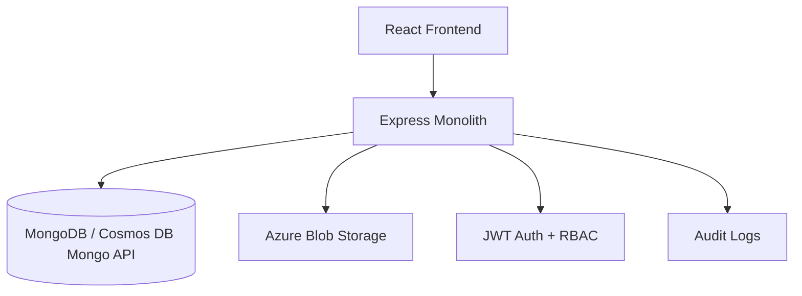

# Insurance Management System

Insurance Management System is a production-ready monolithic application with an Express API, MongoDB or Azure Cosmos DB persistence, Azure Blob document storage, and a React frontend designed for premium enterprise insurance workflows.

## Features

- JWT authentication with `ADMIN` and `USER` roles
- Insurance plan CRUD with active and inactive status control
- Automatic premium calculation by age brackets
- Document upload pipeline with Azure Blob Storage support
- Application workflow with status tracking and admin review
- Admin analytics dashboard with charts and audit logs
- Responsive premium black-and-white UI with dark theme support
- Docker, Azure App Service, and GitHub Actions support

## Architecture Diagram



## Folder Structure

```text
.
|-- backend
|   |-- src
|   |   |-- config
|   |   |-- controllers
|   |   |-- middlewares
|   |   |-- models
|   |   |-- routes
|   |   |-- services
|   |   |-- tests
|   |   |-- utils
|   |   `-- validators
|-- frontend
|   |-- src
|   |   |-- components
|   |   |-- context
|   |   |-- hooks
|   |   |-- pages
|   |   |-- services
|   |   |-- tests
|   |   `-- utils
|-- infra
|-- .github/workflows
|-- Dockerfile
`-- docker-compose.yml
```

## Installation

```bash
git clone <repository-url>
cd Insurance
```

## Environment Variables

Backend variables in `backend/.env.example`:

```env
PORT=5000
MONGODB_URI=mongodb://localhost:27017/insurance-management
COSMOS_DB_URI=
JWT_SECRET=
AZURE_STORAGE_CONNECTION_STRING=
AZURE_CONTAINER_NAME=
AZURE_OCR_FUNCTION_URL=
AZURE_OCR_FUNCTION_KEY=
CLIENT_URL=http://localhost:5173
NODE_ENV=development
```

Frontend variables in `frontend/.env.example`:

```env
VITE_API_URL=http://localhost:5000/api
```

## Local Setup

Backend development:

```bash
cd backend
npm install
npm run dev
```

Frontend development:

```bash
cd frontend
npm install
npm run dev
```

MongoDB:

```bash
mongod
```

Health check:

```bash
curl http://localhost:5000/api/health
```

## Azure Setup

1. Create Azure Cosmos DB with MongoDB API.
2. Create a Storage Account and Blob container.
3. Build and push the root `Dockerfile` image to your container registry.
4. Deploy the image to Azure App Service.
5. Configure App Service settings with production secrets.
6. Set the Azure App Service Startup Command to `npm start`.

## Azure App Service Deployment Steps

1. Create Azure resources:
   - Create an Azure App Service plan on Linux.
   - Create an Azure Web App on that plan.
   - Create Azure Cosmos DB with MongoDB API.
   - Create an Azure Storage Account and Blob container.

2. Build the frontend locally:

```bash
cd frontend
npm install
npm run build
```

3. Install backend dependencies:

```bash
cd ../backend
npm install
```

4. In Azure Portal, open your App Service and set these Application Settings:

```env
PORT=5000
NODE_ENV=production
MONGODB_URI=
COSMOS_DB_URI=<your-cosmos-mongo-connection-string>
JWT_SECRET=<your-secure-secret>
AZURE_STORAGE_CONNECTION_STRING=<your-storage-connection-string>
AZURE_CONTAINER_NAME=insurance-documents
CLIENT_URL=https://<your-app-service-name>.azurewebsites.net
```

5. Set the Azure App Service Startup Command:

```bash
npm start
```

6. Deploy the code to App Service. If you are deploying from local Git or ZIP, make sure the repository includes:
   - `backend/`
   - `frontend/`
   - built frontend assets in `frontend/dist`

7. If you deploy with ZIP after building locally, package the project and deploy:

```bash
npm install
cd backend
npm install
cd ../frontend
npm install
npm run build
```

8. After deployment, confirm the app is running:
   - Open `https://<your-app-service-name>.azurewebsites.net`
   - Open `https://<your-app-service-name>.azurewebsites.net/api/health`

9. If the site does not start, check:
   - App Service Log Stream
   - Startup Command is exactly `npm start`
   - `PORT` is set by Azure or defaults to `5000`
   - Cosmos DB connection string is valid
   - Blob Storage settings are configured correctly
   - If GitHub Actions deploy fails with `Ip Forbidden (CODE: 403)`, review App Service Networking and SCM access restrictions

## Private App Service Architecture

- Keep the Azure App Service private by using a Private Endpoint.
- Put Azure Application Gateway in front of the app for inbound access.
- Route Application Gateway traffic to the App Service private endpoint.
- Disable or tightly restrict public access on the App Service.
- Use private DNS so the App Service hostname resolves to the private endpoint from inside the virtual network.

## Private App Service Deployment Model

- If the App Service uses a Private Endpoint and private networking, GitHub-hosted runners usually can't deploy to the SCM/Kudu endpoint.
- For this architecture, use a self-hosted GitHub Actions runner inside the Azure virtual network, or another deployment agent that has network access to the private App Service SCM endpoint.
- If you keep SCM access restrictions enabled, the deployment runner must be allowed to reach the SCM site.
- Application Gateway is for inbound application traffic. It does not solve CI/CD access to the deployment endpoint.

## Private App Service Deployment Steps

1. Create a virtual network with subnets for:
   - Application Gateway
   - App Service Private Endpoint
   - self-hosted deployment runner if you use GitHub Actions

2. Create the Azure App Service and add a Private Endpoint.

3. Configure private DNS for the App Service private endpoint so internal clients and deployment agents can resolve the app correctly.

4. Create Azure Application Gateway and configure the backend to target the App Service private endpoint.

5. Decide how deployments will run:
   - Preferred: self-hosted GitHub Actions runner in the same virtual network or a peered network
   - Alternative: another private deployment agent with line-of-sight to the SCM endpoint

6. If using GitHub Actions, do not rely on GitHub-hosted runners for private App Service deployment.

7. Configure App Service settings:

```env
NODE_ENV=production
COSMOS_DB_URI=<your-cosmos-mongo-connection-string>
JWT_SECRET=<your-secure-secret>
AZURE_STORAGE_CONNECTION_STRING=<your-storage-connection-string>
AZURE_CONTAINER_NAME=insurance-documents
CLIENT_URL=https://<your-application-gateway-hostname>
```

8. Set the startup command:

```bash
npm start
```

9. Build the frontend before deployment:

```bash
cd frontend
npm install
npm run build
```

10. Deploy from a network-reachable agent, then validate:
   - the app responds through Application Gateway
   - `/api/health` works through the intended private route
   - the SCM/deployment endpoint is reachable only from trusted private infrastructure

## Azure Deployment Troubleshooting

- `Ip Forbidden (CODE: 403)` during `azure/webapps-deploy` usually means the App Service SCM/Kudu endpoint is blocked by Networking rules, Access Restrictions, Private Endpoint configuration, or disabled public access.
- In Azure Portal, open App Service, then check `Networking`:
  - Ensure `Public network access` is enabled if you are deploying directly from GitHub-hosted runners.
  - Review `Access Restrictions` for both the main site and the SCM site.
  - If `SCM site uses main site restrictions` is enabled, make sure those rules also allow deployment traffic.
- If you are using a Private Endpoint or strict IP allowlist, GitHub-hosted runners will often be blocked because their outbound IPs are not fixed for simple allowlisting.
- A quick test is to temporarily remove SCM restrictions, redeploy, then re-apply a secure rule set after confirming deployment works.
- If you must keep the app private, use a self-hosted GitHub runner inside the same Azure virtual network or deploy from Azure DevOps/agent infrastructure that has allowed network access.
- The deprecation warnings from the GitHub Action are not the reason for the deployment failure. The blocking issue is the `403`.

## Cosmos DB Setup

- Use the Azure portal to create a MongoDB API account.
- Copy the primary connection string into `COSMOS_DB_URI`.
- Ensure the database name is `insurance-management` or adjust the URI accordingly.

## Blob Storage Setup

- Create a private blob container named `insurance-documents`.
- Add the connection string to `AZURE_STORAGE_CONNECTION_STRING`.
- Set `AZURE_CONTAINER_NAME=insurance-documents`.

## Azure Function OCR

This project can be extended with a separate Azure Function for OCR. In the current backend flow, OCR is automatically triggered whenever a PDF is uploaded through `POST /api/upload`.

Current PDF flow:

- upload the document from the app
- store the PDF in Azure Blob Storage
- detect that the uploaded file is a PDF
- call the configured Azure OCR Function from the backend
- let the function call Azure AI Vision Read API
- return extracted text to the backend
- include OCR metadata and extracted text in the uploaded document response

Microsoft Learn notes that Node.js Azure Functions v4 usually configure triggers in code instead of `function.json`. Since you asked for `function.json`, the example below uses the classic Node function folder layout, which is still a familiar pattern for HTTP-triggered functions. Source references:
- Azure Functions HTTP trigger: https://learn.microsoft.com/en-us/azure/azure-functions/functions-bindings-http-webhook-trigger
- Node.js Azure Functions reference: https://learn.microsoft.com/en-us/azure/azure-functions/functions-reference-node
- Azure AI Vision Read API: https://learn.microsoft.com/en-us/rest/api/computervision/read/read?view=rest-computervision-v3.1

### OCR Function Structure

```text
ocr-function-app/
|-- host.json
|-- package.json
|-- local.settings.json
`-- OcrHttpTrigger/
    |-- function.json
    `-- index.js
```

### `function.json`

```json
{
  "bindings": [
    {
      "authLevel": "function",
      "type": "httpTrigger",
      "direction": "in",
      "name": "req",
      "methods": ["post"],
      "route": "ocr"
    },
    {
      "type": "http",
      "direction": "out",
      "name": "res"
    }
  ]
}
```

### `index.js`

```javascript
const axios = require('axios');

module.exports = async function (context, req) {
  try {
    const documentUrl = req.body?.documentUrl;

    if (!documentUrl) {
      context.res = {
        status: 400,
        body: {
          success: false,
          message: 'documentUrl is required'
        }
      };
      return;
    }

    const endpoint = process.env.AZURE_VISION_ENDPOINT;
    const key = process.env.AZURE_VISION_KEY;

    if (!endpoint || !key) {
      context.res = {
        status: 500,
        body: {
          success: false,
          message: 'Azure Vision settings are missing'
        }
      };
      return;
    }

    const submitResponse = await axios.post(
      `${endpoint}/vision/v3.1/read/analyze`,
      { url: documentUrl },
      {
        headers: {
          'Ocp-Apim-Subscription-Key': key,
          'Content-Type': 'application/json'
        }
      }
    );

    const operationLocation = submitResponse.headers['operation-location'];

    if (!operationLocation) {
      context.res = {
        status: 500,
        body: {
          success: false,
          message: 'OCR operation location was not returned'
        }
      };
      return;
    }

    let result;
    let attempts = 0;

    while (attempts < 15) {
      await new Promise((resolve) => setTimeout(resolve, 2000));

      const pollResponse = await axios.get(operationLocation, {
        headers: {
          'Ocp-Apim-Subscription-Key': key
        }
      });

      result = pollResponse.data;

      if (result.status === 'succeeded' || result.status === 'failed') {
        break;
      }

      attempts += 1;
    }

    if (!result || result.status !== 'succeeded') {
      context.res = {
        status: 500,
        body: {
          success: false,
          message: 'OCR processing failed or timed out',
          result
        }
      };
      return;
    }

    const extractedText =
      result.analyzeResult?.readResults
        ?.flatMap((page) => page.lines.map((line) => line.text))
        .join('\n') || '';

    context.res = {
      status: 200,
      body: {
        success: true,
        extractedText,
        raw: result
      }
    };
  } catch (error) {
    context.log('OCR function failed', error.message);
    context.res = {
      status: 500,
      body: {
        success: false,
        message: error.response?.data || error.message
      }
    };
  }
};
```

### OCR Function `package.json`

```json
{
  "name": "ocr-function-app",
  "version": "1.0.0",
  "private": true,
  "main": "index.js",
  "scripts": {
    "start": "func start"
  },
  "dependencies": {
    "axios": "^1.7.7"
  }
}
```

### `host.json`

```json
{
  "version": "2.0"
}
```

### `local.settings.json`

```json
{
  "IsEncrypted": false,
  "Values": {
    "AzureWebJobsStorage": "UseDevelopmentStorage=true",
    "FUNCTIONS_WORKER_RUNTIME": "node",
    "AZURE_VISION_ENDPOINT": "https://<your-vision-resource>.cognitiveservices.azure.com",
    "AZURE_VISION_KEY": "<your-vision-key>"
  }
}
```

## Steps To Do OCR Using Azure Functions

1. Create an Azure AI Vision resource in Azure Portal.
2. Copy the endpoint and key from the Azure AI Vision resource.
3. Install Azure Functions Core Tools locally.
4. Create a new Node.js Azure Function app.
5. Add the `function.json`, `index.js`, `host.json`, and `package.json` shown above.
6. Add `AZURE_VISION_ENDPOINT` and `AZURE_VISION_KEY` to `local.settings.json` for local testing.
7. Start the function locally:

```bash
func start
```

8. Call the function locally:

```bash
curl -X POST http://localhost:7071/api/ocr \
  -H "Content-Type: application/json" \
  -d "{\"documentUrl\":\"https://example.com/sample.pdf\"}"
```

9. Deploy the function to Azure:

```bash
func azure functionapp publish <your-function-app-name>
```

10. In Azure, set the same app settings on the Function App:
   - `AZURE_VISION_ENDPOINT`
   - `AZURE_VISION_KEY`
   - copy the function URL or function host + route
   - copy the function key if the function uses `authLevel: function`

11. Update the backend application settings:

```env
AZURE_OCR_FUNCTION_URL=https://<your-function-app>.azurewebsites.net/api/ocr
AZURE_OCR_FUNCTION_KEY=<your-function-key>
```

12. If your documents are already uploaded to Blob Storage, pass the Blob URL to the OCR function instead of uploading the same file again.

13. Restart the backend after adding the OCR settings.

14. Upload a PDF through the insurance application UI. The backend will:
   - upload the PDF to Blob Storage
   - call the Azure OCR Function automatically
   - attach the OCR response to the uploaded document metadata

## OCR Integration Notes

- The sample above uses the Azure AI Vision Read API for OCR.
- The backend currently triggers OCR only for PDF uploads. JPG, JPEG, and PNG files are uploaded normally without OCR.
- If your documents are mostly forms, invoices, or structured PDFs, Azure AI Document Intelligence may be a better fit than plain OCR.
- If your Blob URLs are private, use SAS URLs or let the function download the blob using Azure Storage credentials before sending it to Azure AI Vision.
- For private Azure architectures, the Function App and Vision resource may also need private networking and DNS alignment.

## Docker Setup

```bash
docker build -t insurance-app .
docker-compose up --build
```

## GitHub Actions Setup

- Add `AZURE_CREDENTIALS`, `AZURE_WEBAPP_NAME`, `AZURE_RESOURCE_GROUP`, and `CONTAINER_IMAGE` to GitHub secrets.
- The workflow in `.github/workflows/ci-cd.yml` runs tests, builds the frontend, and updates the App Service container config on `main`.

## API Documentation

Authentication:

- `POST /api/auth/register`
- `POST /api/auth/login`
- `GET /api/auth/profile`

Plans:

- `GET /api/plans`
- `GET /api/plans/:id`
- `POST /api/plans`
- `PUT /api/plans/:id`
- `DELETE /api/plans/:id`

Applications:

- `POST /api/applications`
- `GET /api/applications`
- `GET /api/applications/:id`

Admin:

- `GET /api/admin/dashboard`
- `PUT /api/admin/application/:id/approve`
- `PUT /api/admin/application/:id/reject`

Documents:

- `POST /api/upload`

## Authentication Flow

1. User registers or logs in.
2. API returns a JWT token and user payload.
3. Frontend stores the token in local storage.
4. Axios sends `Authorization: Bearer <token>` on protected requests.
5. Backend middleware enforces RBAC on admin and user routes.

## Screenshots Placeholder

- Landing page
- Admin dashboard
- User dashboard
- Insurance application form

## Troubleshooting

- If uploads return placeholder URLs, set Azure Blob storage credentials.
- If the frontend cannot reach the API, verify `VITE_API_URL`.
- If Cosmos DB is used, confirm the Mongo API connection string includes SSL parameters from Azure.

## Production Deployment

```bash
npm install
npm start
```

Production build command:

```bash
npm run build
```

Azure App Service Startup Command:

```bash
npm start
```

The production server reads `PORT` from the environment, serves the built React app from `frontend/dist` through the Express backend, and does not use `nodemon` in production.

## Security Features

- `helmet`
- `express-rate-limit`
- `cors`
- `bcryptjs`
- `jsonwebtoken`
- `express-mongo-sanitize`
- `xss-clean`
- `multer` file limits and MIME validation
- Joi request validation

## Future Enhancements

- Email and SMS notifications
- Premium quote simulations by dependent coverage inputs
- Payment gateway integration
- Policy renewal reminders

## License

MIT
